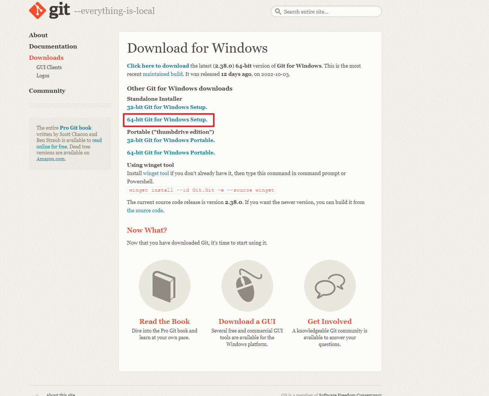

# 前提条件
> 本地电脑需要安装Git

Git官网地址(https://git-scm.com/downloads)

下载windows客户端安装包,直接安装就行,傻瓜式操作


通过scoop命令下载安装git


配置git 的用户名以及邮箱

```Powershell
git config --global user.name "wuxiaohui"

git config --global user.email "wuxiaohui0411@gmail.com"
```


# 配置SSH

## 本地SSH配置密钥

打开PowerShell

配置ssh密钥

```Powershell
ssh-keygen
```
在家目录下会生产一个`.ssh`的隐藏目录


```powershell
cd ~/.ssh
ls
cat ./id_rsa.pub
```

该目录下会有两个密钥,分为公钥、私钥

需要复制公钥的信息


## github配置ssh公钥

### 进入个人Github主页,点击设置


### 左侧菜单栏找到`SSH and GPG keys`,配置新的SSH Key


### 将之前复制的公钥信息进行复制


现在Github Web端与本地电脑已经可以进行ssh通信


## github创建新的repository

### 进行资源主页


### 选择新建


### 创建资源可以选择公开或私有


### 创建成功之后,资源内容页可以复制SSH克隆地址


### 通过命令行克隆仓库

在.ssh目录下创建config的文件,复制以下内容


```
Host *
  KexAlgorithms +diffie-hellman-group14-sha1
```


### 通过命令行同步本地文件至Web端

```powershell
git add .
git commit -m "wuxiaohui"
git pull
```


## 通过VScode控制台克隆仓库(傻瓜式操作)


## 通过VScode控制台同步本地文件


## 配置gitlab


